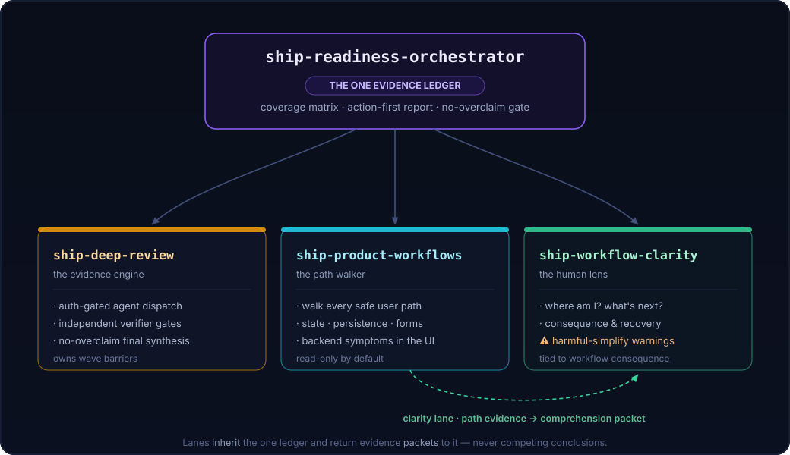

# Shipworthy Architecture — the control stack

**In one line:** Shipworthy is one orchestrator and three lanes — not four equal tools — that produce *one* proof-backed answer, never three skills arguing toward different verdicts.

The point of the whole design: one run gives you one answer, and every part of that answer is backed by proof. The three lanes go find things. Only the orchestrator decides what is true and writes the verdict. Nothing is called "proven" until a separate checker reads the raw evidence and agrees.

Picture a detective case. The orchestrator is the lead detective, and there is one case file. The lanes bring in evidence, but only the lead detective writes findings into the file. A judge who only ever sees the raw evidence — never the detective's write-up — has to sign off before anything is final. This page says who is allowed to do what, so that someone editing one skill doesn't start a second case file by accident.

<div align="center"></div>

## Contents

- [Key terms](#key-terms) — the words the rest of this page uses
- [The one rule](#the-one-rule) — the constraint everything else follows from
- [Ownership map](#ownership-map) — who owns what
- [Control flow](#control-flow) — how a run goes, start to finish
- [Safe-test boundary](#safe-test-boundary-why-its-read-only-by-default) — why it's read-only by default
- [Degradation](#degradation) — what happens when a skill is missing
- [Four self-contained skills](#four-self-contained-skills) — how they install
- [Lean host-native evidence flow](#lean-host-native-evidence-flow) — what Shipworthy does and doesn't run
- [The evidence-state contract](#the-evidence-state-contract-for-contributors) — the rules for extending a lane

## Key terms

Skim these once and the rest of the page reads fast.

- **orchestrator** — the lead skill, `ship-readiness-orchestrator`. Builds the one ledger, runs the waves, and speaks the verdict. (The lead detective.)
- **lane** — one of the three specialist skills the orchestrator directs. Lanes gather evidence and hand it in; they never write the ledger or call the verdict.
- **packet** — the raw findings a lane hands back — what it saw, not a final answer.
- **canonical ledger** — the one official record of what has actually been proven. The single source of truth. (The case file.)
- **candidate inventories / coverage manifest** — the independent lists of everything worth testing, and the record of what happened to each item.
- **frontier** — the live to-do list of things still worth testing that could change the verdict.
- **evidence debt** — something suspected but not yet proven. It stays tracked until it's proven, ruled out, blocked, or scoped out.
- **provenance tag** — a label on a fact saying where it came from, so the same fact isn't counted twice.
- **verifier** — an independent checker that reads the raw evidence (never a polished summary) and must approve before a wave is summarized. (The judge.)
- **gate** — a required checkpoint in the run's control flow, such as the Start Gate or the Frontend Path-Walk Gate.
- **wave** — one round of evidence-gathering (parallel when authorized, otherwise sequential), sealed by a verifier check before the next round starts.

## The one rule

Everything on this page comes from one rule:

> Product-workflow and clarity work feed evidence **packets** into the orchestrator's single canonical ledger, inheriting prior evidence instead of re-deriving or double-counting it. Lane skills never write the canonical ledger and never publish their own readiness verdict.

The canonical ledger is the case file: the one official record of what has actually been proven. Keep it as the only one and the whole design holds up. Let any lane keep its own record or call its own verdict, and you get the exact mess this system exists to stop — two "truths" that disagree. Everything below follows from that rule.

## Ownership map

Every job has exactly one owner, and the split is simple: the orchestrator owns the single source of truth; the three lanes only gather evidence.

### What the orchestrator owns

Each job below is one *layer* of the truth. Think of layers as separate boxes — one for what's proven, one for what still needs testing, one for what's unsure. Keeping the boxes apart is what keeps the answer honest. All six jobs belong to `ship-readiness-orchestrator`.

| Job | What it means |
|---|---|
| Canonical **claim ledger** — the truth layer (proven facts) | The only place a material claim — one that matters to the verdict — becomes official. Lanes just hand in raw packets. |
| **Candidate inventories + coverage manifest** — the scope layer (what could be tested) | Three separate lists of everything worth testing — one from the docs, one from the code, one from the running app. Each keeps its own raw pointers and digests (fingerprints of the source). Every item maps to exactly one spot on the frontier, or is noted as a difference to sort out. |
| **Path frontier** — the execution and finality layer (the to-do list) | The live to-do list of things still worth testing. A full run stays open while safe work is left, and only closes when fresh searches stop finding anything new — not after three waves. |
| **Continuation handoff** — the unfinished-work layer | If a run stops with work left, the reply spells out exactly what's unresolved — which paths, which unproven items, which gates — and ends by asking whether to keep going, and whether to make finishing a saved, persistent goal. |
| **Evidence-debt register** — the uncertainty layer (not proven yet) | "Evidence debt" is anything we suspect but haven't proven. It stays on this list until it's proven, ruled out, blocked, or put out of scope. It's never quietly dropped. |
| **Readiness language** (`ready`, `secure`, `beloved`, `viral`, …) | Any word like these gets toned down unless a ledger row directly backs it up. |

### What the three lanes own

Each lane gathers one kind of evidence and hands it back as packets. None of them writes the ledger.

| Lane | What it owns |
|---|---|
| `ship-deep-review` | **Wave barriers, verifier gates, final synthesis.** No wave gets a summary until every agent output is read, the ledger is updated, and an independent verifier has read the raw outputs for itself. |
| `ship-product-workflows` | **Path discovery, safe execution, backend-symptom tracing.** Clicks or traces user paths and hands back product evidence. Calls in the clarity lane when something might confuse a user, or when an action carries real consequences. |
| `ship-workflow-clarity` | **Human-obviousness, comprehension, recovery, trust critique.** Judges whether a person can tell what's happening and what to do next. Hands back short notes tied to real user consequences — never its own full ledger. |

The lanes hand in packets. Only the orchestrator puts anything in the ledger or says the verdict.

## Control flow

Every run follows the same path: a few setup checks, then rounds of gathering evidence. Each round is sealed by an independent check. It repeats until there is nothing safe left to test, and then it writes the report.

```text
Start Gate -> Sub-Skill Load Gate -> Goal Mode Persistence Gate
    |             (read all 3 sub-skill bodies before dispatch)
    v
Multi-Agent Authorization Gate -> Frontend Path-Walk Gate
    |
    v
Declared/static/runtime candidate inventories -> canonical manifest/frontier -> lane roster
    |
    v
Wave 1 (authorized parallel lanes or sequential fallback)
    |
    v
Verified Barrier  (ship-deep-review owns this)
    read all raw outputs -> update ledger -> INDEPENDENT verifier shadow-read
    -> verifier approves? -- no --> gather proof / mark checkpoint incomplete
                          `- yes -> write certified wave summary
    |
    v
Retarget next wave from verified findings + evidence debt (not the original split)
    |
    v
Fix-cascade check -> final no-overclaim verifier -> final report
```

### A run from start to finish

Say you point Shipworthy at a checkout app and type `are we shipworthy?`.

First the setup checks. It writes down what it's testing and what it's allowed to touch (the Start Gate), and it reads all three lane skills before doing anything (the Sub-Skill Load Gate). At the next two gates it asks you — in Codex — to turn on persistent goal mode and parallel agents; in Claude Code it usually just goes. The Frontend Path-Walk Gate sees a running app, so the run commits to actually clicking through it instead of only reading the code.

Now the work. The orchestrator builds its lists of what to test, turns them into one frontier, and sends out Wave 1: the lanes map the routes, walk the guest-checkout path, and judge how clear it is — all at the same time. At the Verified Barrier, `ship-deep-review` reads every raw output, updates the ledger, and hands those raw outputs — not a tidy summary — to an independent verifier, who works out the findings alone and then approves. Wave 2 reproduces a suspected silent payment failure and confirms it. Wave 3 asks what got missed and checks the release gates. A load test has no safe place to run, so it's marked evidence debt; a real-email path can't be sent safely, so it's marked avoided — neither counts as a pass. A final checker makes sure the report doesn't claim more than the ledger proves. The verdict is NOT READY, because the payment bug is a confirmed blocker. The HTML report is written. Since safe work is still left, the reply lists it and asks whether to keep going.

### Why a full run isn't just "three waves"

"Full blast" means at least three checked waves — not exactly three. Wave 1 looks broadly. Wave 2 digs in and chases anything that doesn't add up. Wave 3 asks what was missed and checks the release gates. The run keeps going past three whenever something could still change the verdict — a big group of routes, a user role, a screen state, missing proof, a contradiction, or an unproven item. It stops when the evidence runs out, not when a counter hits three.

"Runs out" is about evidence, not effort. Before it starts, every full run locks in its lists of what to test, keeps the raw pointers and digests, and maps every item to exactly one spot on the frontier — or notes it as a difference to sort out later. Each spot on the frontier gets one status. The seven final statuses are:

- `covered` — tested or traced, with enough proof;
- `sampled_with_justification` — checked a few representative versions, with a written reason full testing wasn't needed or wasn't possible (safe important controls still need real proof);
- `blocked` — couldn't get to it: no access, setup, login, data, environment, or a tool broke;
- `avoided` — skipped on purpose because doing it was risky: it could change data, cost money, publish, need approval, be destructive, touch private data, or hit production;
- `missing` — a normal thing a user would want has no path at all;
- `out_of_scope` — left out by you, or by route, time, file, or risk limits;
- `evidence_debt` — we know about it but haven't proven it, and no stronger label fits yet.

Three more statuses — `unattempted`, `unknown`, and `maybe` — are not final. The run can't say it's done while any real item is still one of these, and a guess stays evidence debt until proof settles it. Closing the frontier also needs two separate searches, done in different ways, to both come up empty — one search alone can miss what another would catch.

Three things get mixed up easily, so keep them apart: whether the audit finished, whether the testing is complete, and what the ship decision is. A finished, fully tested audit can still say `not_ready` — proving an app is broken is a finished job, not an unfinished one.

Last thing: every run — full or cut-down — must write the HTML report from the final ledger to `~/.shipworthy/runs/<target-slug>/<timestamp>/readiness-report.html`, unless you ask for it inside the repo instead. A cut-down run changes what the report says, never whether it exists.

### Three gates that depend on the platform

Every full run records these three gates. Each one behaves differently depending on the host, because Codex and Claude Code give you different controls. The idea is the same every time: use the allowed path when you can; when you can't, downgrade gracefully and write down what happened; and never treat a Shipworthy instruction as beating the host's own rules.

- **Goal Mode Persistence Gate.** In Codex, you get the best results by running `/goal are we shipworthy?` and answering `yes` when it asks to turn on persistent goal mode and parallel subagents. Claude Code has no `/goal` switch like that. When persistent goal mode isn't available or isn't turned on, Shipworthy writes down `goal_mode_status` and uses a goal-equivalent resumable ledger instead — a saved checkpoint that lets the run pick up where it left off. Skill instructions don't override the host's goal-mode rules.
- **Frontend Path-Walk Gate.** If there's something real to click — a runnable UI, hosted app, local dev server, browser-hosted prototype, desktop app, Chrome session, in-app browser surface, or Computer Use target — then "full" means actually using the product like a person would. Source, CLI, HTTP, tests, logs, docs, provider checks, and database probes can back that up, but they can't replace it. If no real click-through happened, the result is conditional, static, or limited — not a full Shipworthy run.
- **Multi-Agent Authorization Gate.** You get the best results by answering `yes` when it asks to turn on parallel subagents. Codex has to ask before it starts them; Claude Code usually doesn't. If you don't say yes, the same set of lanes runs one at a time instead, and the report writes down `sequential fallback because multi-agent authorization was not granted` as orchestration debt. Shipworthy instructions don't override the host's tool rules.

### Four rules that keep the lanes aligned

- **A lane's own "waves" are just its own note-taking.** If a lane's idea of a wave clashes with the orchestrator's, `ship-deep-review` is the one that owns the real barriers, gates, and summaries.
- **The stricter rule wins.** If a lane's instructions clash with the orchestrator's, go with whichever rule is stricter about safety, evidence, or how things get combined.
- **The verifier has to stay independent.** It gets the raw outputs plus the short ledger — never a polished write-up. Hand a verifier the finished story and it just nods along. `ship-deep-review` has a name for that trap: *draft-summary laundering* — writing the summary first and asking the verifier to rubber-stamp it. The verifier is the judge who only ever sees the raw evidence, not the closing speech.
- **One driver per running app.** Lanes can map, inspect, disprove, and check at the same time, but a single running app is driven by one coordinated driver — unless separate users, resettable fixtures, throwaway data, separate browser profiles, or read-only screens make clicking at the same time safe.

## Safe-test boundary (why it's read-only by default)

Shipworthy checks a product without changing it. Every run writes down a target fingerprint — repo, branch, commit, whether the working copy is dirty, the runtime URL or launch command, the account/role/fixture, the viewport, and where evidence gets saved — plus a safe-test boundary: what it's allowed to do, what it must not do, what could go wrong, how to reset, and when to stop. It stays read-only unless you clearly approve the exact action *and* there's a verified non-production reset or sandbox to catch it; a throwaway fixture on its own isn't enough. Anything that changes data, costs money, is destructive, publishes, needs permission, touches private data, or hits production stops at the line. Shipworthy tells you the smallest useful fix and the exact way to check it, and it won't apply fixes unless you explicitly ask after the review.

## Degradation

The four skills only form a full graph when all four are present — and they fail loudly, not quietly, when one is missing. If a needed skill can't be found or read, the orchestrator's Sub-Skill Load Gate stops the normal run, says which skill is missing, and keeps going only as a clearly labeled cut-down version, noted as evidence debt. That's why the skills ship together but also install on their own: a missing lane is announced, never silently skipped.

## Four self-contained skills

There are exactly four skills, and each one works on its own. Every skill keeps its detailed contracts and schemas in its own `references/` folder. The deterministic code that turns the finished ledger into HTML, SARIF, and evidence bundles lives inside the orchestrator (the same input always gives the same output). The full-run renderer also runs the bundled Draft 2020-12 JSON schemas using Python's `jsonschema`, and it fails closed if that checker isn't installed — checking the data is part of the deal, not an extra.

Install each skill folder straight into the host's skills directory. The repository itself is not a skill, and it must not become an extra folder layer around them. Codex, Claude Code, or any other `SKILL.md`-compatible agent should drop the four folders next to your other skills, and back up any existing versions before replacing them.

## Lean host-native evidence flow

Shipworthy routes and records evidence; it never drives a browser itself. The four skills are still the whole product. Codex or Claude does the actual browser clicking, and an existing Playwright setup that already belongs to the target can produce repeatable test evidence — but Shipworthy starts neither. It only takes in evidence and attachments that are handed to it, within set limits.

```text
Codex/Claude native browser ─┐
                            ├─ skill-owned contracts ─ canonical ledger
Existing Playwright report ─┘                     ├─ HTML
                                                  ├─ SARIF
                                                  └─ evidence bundle
```

Both inputs get turned into one fixed evidence shape, then attach to finding IDs that already exist in the ledger (the canonical v1 ledger). The attachment step keeps each finding's identity, action, proof, severity, confidence, gate, and verifier status exactly as they were. Anything missing — lost files, evidence channels that weren't available, real limits — stays on the list as named evidence debt. A screenshot only proves what was on screen when it was taken; Playwright evidence counts as deterministic — the same result every time — only as far as the supplied report, the local files, and the target's own test actually support it.

The split of duties is on purpose. The host owns browser control, running shells and tests, keeping the target's repo safe, and the call to reuse an existing Playwright setup. The skill references own the careful checking, the cautious cleanup of data, the paper trail, the limits on how strong proof can get, and the evidence-debt rules. The three local scripts only reshape the final data they're handed — they do not open browsers, install anything, hit the network, or change the app being audited.

The boundary also leaves things out, on purpose. Shipworthy is:

- **not a runtime of its own** — no browser runner or scripting language (a DSL), no background daemon, no scheduler, no hosted runner;
- **not a data store** — no database, no storage service, no credential store (a place to store logins);
- **not a product surface** — no public CLI product, no MCP server, no portal, no account system, no billing or multi-tenant setup;
- **not an outside integration** — no external-provider hookups.

The adapter layer doesn't imply any of these, and this architecture doesn't allow them.

## The evidence-state contract (for contributors)

If you add to a lane, every finding in your packet has to carry four things: a severity, a confidence, a provenance tag, and a coverage label. A provenance tag just says where a fact came from — which lane or which kind of evidence found it — so the same fact gets counted once instead of again every time another lane repeats it.

Do not:

- call a claim "confirmed" with no evidence behind it — a file anchor, a trace, a screenshot, a console or network entry, or command output;
- redo a fact another lane already found without carrying its provenance tag, which counts it twice;
- claim how something behaves, saves, is accessible, or can be reached from a screenshot alone;
- write a readiness verdict from inside a lane — only the orchestrator does that, and only after the final no-overclaim verifier has passed.

Keep one record of what's true, and keep what's unsure out in the open. That is the product.
