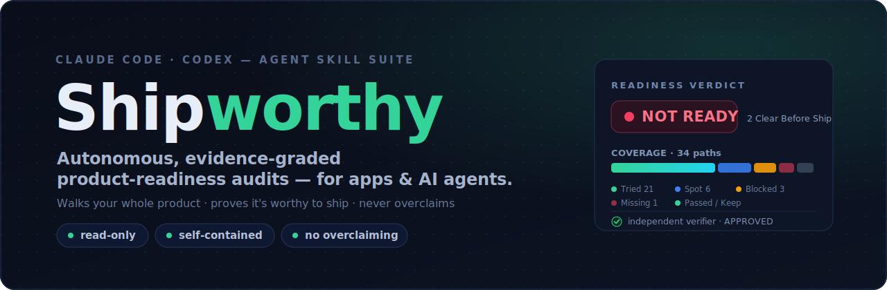
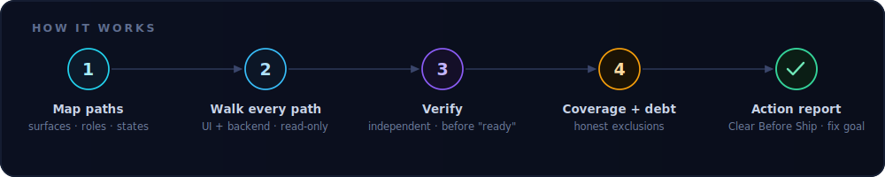
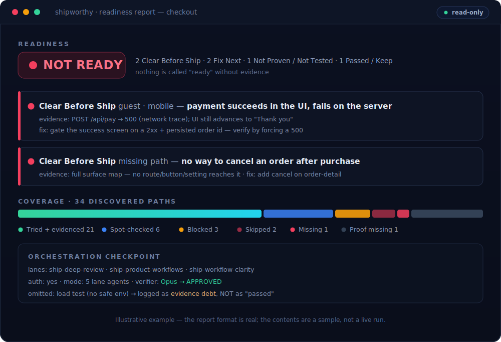
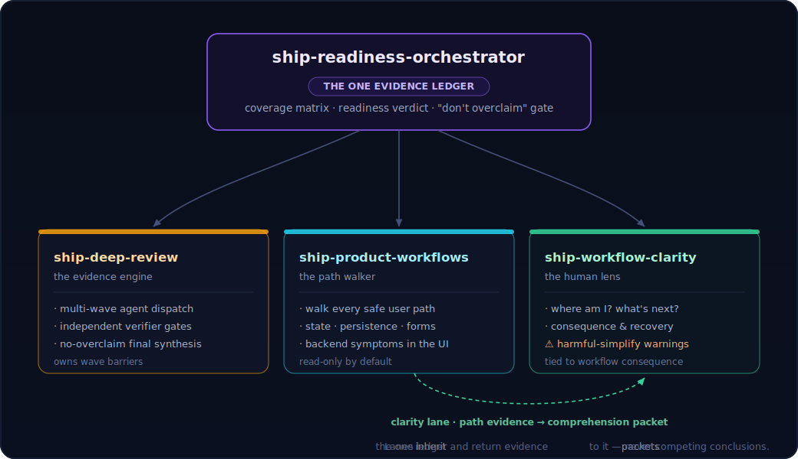

<div align="center">



### Autonomous, evidence-graded product-readiness audits — for apps &amp; AI agents.

It walks your whole product like your most paranoid senior engineer — **every screen, every path, and the backend underneath** — then proves whether you're ready to ship.

[](https://github.com/NeuraCerebra-AI/shipworthy)
[](LICENSE)
[](https://github.com/NeuraCerebra-AI/shipworthy/actions)
[](https://code.claude.com/docs/en/skills)
[](https://github.com/NeuraCerebra-AI/shipworthy/releases)

**✓ Read-only by default  ✓ Self-contained markdown  ✓ No telemetry  ✓ No credential access  ✓ No auto-update**

</div>

---

## 😱 What silently breaks without this

Most "it works on my machine" ships die on the things a quick look never catches:

- The path that **technically completes** but is buried six clicks deep, repeats a decision, or dead-ends on reload.
- The backend call that fails while the UI stays **cheerfully green** — nobody notices until a customer does.
- The thing a user will **obviously** try — export, undo, invite a teammate, recover from a failed upload — that has **no path at all**.
- The screen that *looks* finished, retains no attention, and quietly leaks trust.
- And the meta-failure: an audit that declares **"ready"** after sampling three happy paths and calling it a day.

Shipworthy finds all of the above **and refuses the last one.** It treats "try every path" as a coverage ambition with honest exclusions — not a claim of omniscience — and keeps a live evidence ledger so every readiness statement traces back to proof.

<div align="center"></div>

## ⚡ Install in 30 seconds

In **Claude Code**, add the marketplace and install the plugin (bundles all four skills):

```bash
/plugin marketplace add NeuraCerebra-AI/shipworthy
/plugin install shipworthy@shipworthy
/reload-skills
```

Then just ask:

```text
Use ship-readiness-orchestrator in full blast on ./my-app.
Try every safe user path, find missing and overcomplicated paths,
critique clutter, and report ledger-backed readiness. Do not implement fixes.
```

<details>
<summary><b>Prefer a manual install (Codex, or copy the folders)?</b></summary>

```bash
git clone https://github.com/NeuraCerebra-AI/shipworthy.git
cd shipworthy && ./install.sh   # copies the 4 skills into ~/.claude/skills or ~/.codex/skills
```
Or copy any single skill folder from `plugins/shipworthy/skills/` into your skills directory — each one works on its own.
</details>

## 🎬 What a run looks like

<div align="center"></div>

<sub>*Illustrative — the report format is real; the contents are a sample, not a live run. A recorded asciinema/GIF walkthrough → `docs/demo.gif`; PRs welcome.*</sub>

> **Want it shareable?** The same run renders to a self-contained **HTML report** (verdict, coverage bar, severity-grouped findings, checkpoint — inline CSS, no JS, no network) via `scripts/render_report.py`. See [`visual-html-report.md`](plugins/shipworthy/skills/ship-readiness-orchestrator/references/visual-html-report.md).

<details><summary><b>See the same report as raw text</b></summary>

```text
── READINESS: NOT READY (2 blockers, 1 strong, 3 provisional) ──────────────

[Blocker][Confirmed] Checkout / guest / mobile: payment fails silently
  Evidence: POST /api/pay → 500 (network trace); UI advances to "Thank you"
  User consequence: customer believes they paid; support ticket + chargeback risk
  Fix: gate the success screen on a 2xx + persisted order id
  Verify: force a 500, confirm the UI shows a recoverable error and writes no order

[Blocker][Confirmed] No path exists: "cancel an order after purchase"
  Evidence: full surface map — no route, button, or setting reaches cancellation
  Fix: add a cancel affordance on the order-detail screen (smallest viable path)

── COVERAGE (34 discovered paths) ───────────────────────────────────────────
  covered 21 · sampled 6 · blocked 3 (paid) · avoided 2 (prod email)
  missing 1 (order cancellation) · evidence_debt 1 (load, not run)

── ORCHESTRATION CHECKPOINT ─────────────────────────────────────────────────
  lanes: ship-deep-review, ship-product-workflows, ship-workflow-clarity
  mode: 5 parallel agents · verifier: Opus, APPROVED
  omitted: load test (no safe env) → logged as evidence debt, NOT as "passed"
```
</details>

Notice what it *doesn't* do: it never calls the app "ready," never claims the untested path passed, and never silently changes your code. It hands you the smallest fix and the exact way to verify it.

## 🧩 The four skills

| Skill | Role | Use it alone when… |
|---|---|---|
| **ship-readiness-orchestrator** | The conductor. Owns the one evidence ledger, the coverage matrix, and the readiness verdict; dispatches and reconciles the three lanes without letting them overclaim. | You want the full "is this ready to ship / be beloved / be viral" pass. |
| **ship-deep-review** | The evidence engine. Multi-wave agent dispatch with a hard rule: no wave summary until an **independent verifier** has checked the raw outputs against the claim ledger. | You want a hostile, multi-wave review or research validation. |
| **ship-product-workflows** | The path walker. Safely tries or traces every meaningful user path — UI, state, persistence, forms, nav, permissions, and backend symptoms that surface in the UI. | You want to know where a specific app or feature actually breaks. |
| **ship-workflow-clarity** | The human lens. Judges whether a person can tell where they are, what to do next, what will and won't happen, and how to recover — and warns when a "simpler" fix strips proof, governance, or recovery. | You want a clarity read on a screen, flow, or dashboard. |

## 🗺️ How it fits together

<div align="center"></div>

One truth layer, proven. The lanes feed evidence *packets* into the orchestrator's single ledger — they never publish competing conclusions. Full control stack in **[docs/architecture.md](docs/architecture.md)**.

## ⚖️ How it's different

| | **Shipworthy** | Just running an agent yourself | Code scanners (SonarQube, etc.) |
|---|:---:|:---:|:---:|
| Walks real **user paths** (UI) | ✅ | 🟡 ad hoc | ❌ |
| Checks **backend symptoms tied to UI** | ✅ | 🟡 | 🟡 static only |
| **Coverage map** with honest exclusions | ✅ | ❌ | ❌ |
| **Independent verifier** before it says "ready" | ✅ | ❌ | ❌ |
| Refuses to **overclaim** readiness | ✅ | ❌ | ❌ |
| **Read-only**, hands you the fix + verify step | ✅ | 🟡 | 🟡 |

Shipworthy isn't a "ship faster" boilerplate and it isn't a linter. It's the thing that tells you — with receipts — whether you *should* ship.

## 🔒 Safe by design

Skills are **self-contained markdown** — no bundled executables that run on install, no telemetry, no credential access, no network calls of their own, no auto-update. When auditing, Shipworthy is **read-only by default** and uses only the tools you already have (browser, agents) inside an explicit safe-test boundary; it stops at mutating, paid, destructive, publishing, or production actions unless you authorize the exact action in a disposable environment. It reports the smallest useful fix and an exact verification step — it does not apply fixes unless you ask after the review.

## 🙋 FAQ

**Is this a linter or a security scanner?** No. Those read code. Shipworthy walks the *product* — the paths a user takes and the backend behind them — and issues an evidence-backed readiness verdict.

**Does it need my source code?** It works from whatever you give it: a running app, a repo, a diff, screenshots, or docs. Runtime evidence yields the strongest confidence; static-only inputs stay honestly bounded.

**Will it change my code?** No — read-only by default. It gives you the fix and the verification step; you decide.

**Claude Code only?** It's built on the open `SKILL.md` standard, so it also runs in Codex and other SKILL.md-compatible agents. `./install.sh` covers the manual path.

**Why "Shipworthy"?** Because the tool tells you whether your product is *worthy* of shipping — an earned, evidence-backed verdict, not a naked score. The full naming story (and the eight names that were already taken) is in **[docs/naming.md](docs/naming.md)**.

## 🤝 Contributing

PRs welcome — we aim to respond within 48 hours. Great first contributions: new archetype overlays, better path-discovery heuristics, real worked examples, and a recorded demo. Start with issues labeled `good first issue`, and read **[CONTRIBUTING.md](CONTRIBUTING.md)** (the one rule: never add a second source of truth, and never let a lane declare "ready").

## ⭐ Star this if it saved you a bad launch

If Shipworthy caught something before your users did, a star helps other teams find it — and it's the only metric this repo cares about.

[](https://star-history.com/#NeuraCerebra-AI/shipworthy&Date)

## 📚 Docs

- **[Architecture](docs/architecture.md)** — the control stack: who owns evidence, wave barriers, verifier gates.
- **[Naming](docs/naming.md)** — how the names were chosen (and the 8 that were taken) + the GitHub SEO kit.
- **[Launch playbook](docs/launch.md)** — where to list it, how to launch it, the exact About + Topics.

## 📄 License

MIT — see **[LICENSE](LICENSE)**.

<div align="center"><sub>Shipworthy · walk the whole product · prove it's worthy to ship · don't pretend</sub></div>
