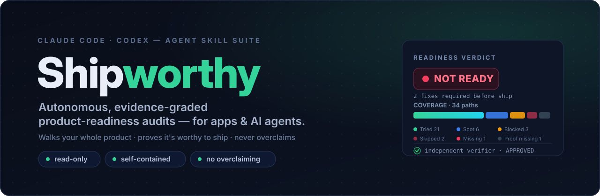
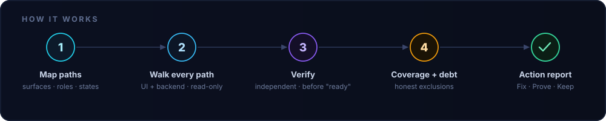
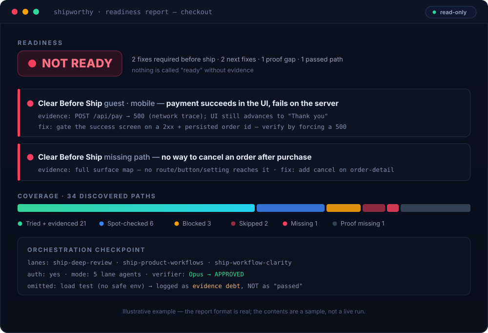

<div align="center">



### Autonomous, evidence-graded product-readiness audits — for apps &amp; AI agents.

It walks your whole product like your most paranoid senior engineer — **every safe discoverable screen and path, plus the backend underneath** — then proves whether you're ready to ship.

[](https://github.com/NeuraCerebra-AI/shipworthy)
[](LICENSE)
[](#-the-four-skills)
[](https://github.com/NeuraCerebra-AI/shipworthy/releases)

**✓ Read-only by default  ✓ Self-contained markdown  ✓ No telemetry  ✓ No credential access  ✓ No auto-update**

</div>

---

## 😱 What silently breaks without this

Most "it works on my machine" ships die on the things a quick look never catches:

- The path that **technically completes** but is buried six clicks deep, repeats a decision, or dead-ends on reload.
- The backend call that fails while the UI stays **cheerfully green** — nobody notices until a customer does.
- The thing a user will **obviously** try — export, undo, invite a teammate, recover from a failed upload — that has **no path at all**.
- The screen that *looks* finished, retains no attention, and quietly leaks trust.
- And the meta-failure: an audit that declares **"ready"** after sampling three happy paths and calling it a day.
- The audit that actually finds a path, then drops or mislabels it while merging agent output — leaving a final report that looks more complete than the evidence.

Shipworthy finds all of the above **and refuses the last two.** It treats "try every path" as a coverage ambition with honest exclusions — not a claim of omniscience — and keeps a live evidence ledger so every readiness statement traces back to proof. Every material observation must reach an exact path, finding, proof gap, rejection, or scope boundary; role, state, device, and interaction variants cannot be silently cross-credited.

<div align="center"></div>

## ⚡ Install in 30 seconds

Open Codex or Claude Code and ask:

> Install the four top-level skills from
> [NeuraCerebra-AI/Shipworthy](https://github.com/NeuraCerebra-AI/Shipworthy)
> into this environment's skills directory. Install each folder as a separate
> skill—not the repository as one nested skill.

The four skill folders should end up directly beside the user's other skills.
Start a new session after installation so the host discovers them.

Then ask:

```text
Are we shipworthy?
```

That phrase is the flagship trigger: Shipworthy runs the full readiness
orchestrator unless you explicitly ask for a rapid, narrow, changed-only, or
static-only pass. It maps the path universe, tries every safe discoverable user
path, hunts for missing and overcomplicated paths, asks for multi-agent
authorization when the platform requires it, uses agents where authorized and
safe, runs verified waves, and generates a self-contained HTML report from the
final ledger.

Full Shipworthy ends from source-backed exhaustion, not vibes, a fixed wave
count, or a timer. It freezes independent declared, static, and runtime
candidate inventories, maps every raw candidate to one canonical frontier, and
keeps that frontier open while safe authorized work remains. Two distinct
negative discovery methods must independently find no new candidates before
coverage can qualify as closed.
It also audits the evidence chain of custody: observations collected by runtime
lanes, source inventories, control censuses, and verifiers must survive into the canonical ledger
without being dropped, merged across different behaviors, or assigned to the
wrong role, state, viewport, or control.

Audit completion, coverage qualification, and the release decision are separate:
a fully completed audit can still conclude **not ready**, while insufficient
proof concludes **cannot determine** rather than being mislabeled as a no-go.
Whenever paths, variants, proof, inventory differences, or required gates remain
unfinished, the final response and HTML report include an exhaustive **Remaining
Work** register and end by asking whether to continue and whether to make that
continuation a persistent goal. A fully covered `not_ready` audit instead offers
the fix handoff because the defects are known rather than untested.

For the flagship run, "tries every safe discoverable user path" means using the
actual frontend when one is available: browser, in-app browser, Chrome,
Playwright, Computer Use, or the app UI itself. Repo/source, CLI, HTTP, tests,
logs, provider checks, database probes, and docs are supporting evidence, not a
substitute for walking the product like a user.

## 🎬 What a run looks like

<div align="center"></div>

<sub>*Illustrative — the report format is real; the contents are a sample, not a live run.*</sub>

> Every operational Shipworthy run renders a self-contained **HTML report** by default (verdict stamp, coverage bar, action-first findings, evidence-reconciliation summary, checkpoint — inline CSS, no JS, no network) via `scripts/render_report.py`. If a run is downgraded, the report still exists and shows why. See [`visual-html-report.md`](ship-readiness-orchestrator/references/visual-html-report.md).

The report is meant to tell you what to do next, not bury you in audit prose:
**Clear Before Ship** blocks readiness, **Fix Next** is real but non-blocking,
**Not Proven / Not Tested** is not a pass, and **Passed / Keep** worked under
the tested conditions. Each card says whether to Fix, Prove, Decide, Skip, or
Keep, plus how strong the proof is.

<details><summary><b>See the same report as raw text</b></summary>

```text
── READINESS: NOT READY ────────────────────────────────────────────────────

[Clear Before Ship][Fix][Confirmed] Checkout / guest / mobile: payment fails silently
  Evidence: POST /api/pay → 500 (network trace); UI advances to "Thank you"
  User consequence: customer believes they paid; support ticket + chargeback risk
  Fix: gate the success screen on a 2xx + persisted order id
  Verify: force a 500, confirm the UI shows a recoverable error and writes no order

[Clear Before Ship][Fix][Confirmed] No path exists: "cancel an order after purchase"
  Evidence: full surface map — no route, button, or setting reaches cancellation
  Fix: add a cancel affordance on the order-detail screen (smallest viable path)

[Fix Next][Fix][Partial] Coupon field silently ignores invalid codes
  Evidence: 3 invalid codes → no message, no error state, field clears
  Verify: bad code stays visible and gets a clear inline message

[Not Proven / Not Tested][Prove][Not tested] Production order email
  Evidence: avoided to prevent sending real email; logged as evidence debt
  Prove: add a sandbox email sink and rerun the path

[Passed / Keep][Keep][Confirmed] Happy-path guest checkout reaches order detail
  Evidence: cart → address → payment sandbox → confirmation → order detail

── COVERAGE (34 discovered paths) ───────────────────────────────────────────
  Tried + evidenced 21 · Spot-checked 6 · Blocked 3 (paid)
  Skipped for safety 2 (prod email) · Missing 1 · Proof missing 1 (load)

── ORCHESTRATION CHECKPOINT ─────────────────────────────────────────────────
  lanes: ship-deep-review, ship-product-workflows, ship-workflow-clarity
  goal_mode_status: explicitly authorized
  authorization: yes
  mode: 5 lane agents · verifier: Opus, APPROVED
  frontier: 34 total · 0 unattempted · finality exhausted · qualification incomplete
  omitted: load test (no safe env) → logged as evidence debt, NOT as "passed"
```
</details>

Notice what it *doesn't* do: it never calls the app "ready," never claims the untested path passed, and never silently changes your code. It hands you the smallest fix and the exact way to verify it.

At the end of a run, Shipworthy should ask whether you want to start a persistent fix goal
for the **Clear Before Ship** items using authorized subagents where helpful. Reply `yes` when you want it to
apply the fixes safely, verify each one, and regenerate the Shipworthy HTML report.

## 🧩 The four skills

| Skill | Role | Use it alone when… |
|---|---|---|
| **ship-readiness-orchestrator** | The conductor. Owns the one evidence ledger, the coverage matrix, and the readiness verdict; dispatches and reconciles the three lanes without letting them overclaim. | You want the full "is this ready to ship / be beloved / be viral" pass. |
| **ship-deep-review** | The evidence engine. Multi-wave agent dispatch with a hard rule: no wave summary until an **independent verifier** has checked the raw outputs against the claim ledger. | You explicitly invoke `ship-deep-review` by name, or the active readiness orchestrator loads it as its required controller. Generic review or audit language does not activate it. |
| **ship-product-workflows** | The path walker. Safely tries or traces every meaningful user path — UI, state, persistence, forms, nav, permissions, and backend symptoms that surface in the UI. | You want to know where a specific app or feature actually breaks. |
| **ship-workflow-clarity** | The human lens. Judges whether a person can tell where they are, what to do next, what will and won't happen, and how to recover — and warns when a "simpler" fix strips proof, governance, or recovery. | You want a clarity read on a screen, flow, or dashboard. |

## 🗺️ How it fits together

<div align="center"></div>

One truth layer, proven. The lanes feed evidence *packets* into the orchestrator's single ledger — they never publish competing conclusions. Full control stack in **[ARCHITECTURE.md](ARCHITECTURE.md)**.

## ⚖️ How it's different

| | **Shipworthy** | Just running an agent yourself | Code scanners (SonarQube, etc.) |
|---|:---:|:---:|:---:|
| Walks real **user paths** (UI) | ✅ | 🟡 ad hoc | ❌ |
| Checks **backend symptoms tied to UI** | ✅ | 🟡 | 🟡 static only |
| **Coverage map** with honest exclusions | ✅ | ❌ | ❌ |
| Proves raw observations survived into the final ledger and report | ✅ | ❌ | ❌ |
| **Independent verifier** before it says "ready" | ✅ | ❌ | ❌ |
| Refuses to **overclaim** readiness | ✅ | ❌ | ❌ |
| **Read-only**, hands you the fix + verify step | ✅ | 🟡 | 🟡 |

Shipworthy isn't a "ship faster" boilerplate and it isn't a linter. It's the thing that tells you — with receipts — whether you *should* ship.

## 🔒 Safe by design

Skills are **self-contained folders** — markdown instructions, local resources,
and three optional local output scripts that never run during installation.
The current full-run renderer uses Python `jsonschema` to execute the bundled
schemas and fails closed if it is unavailable. There is no telemetry,
credential access, network call, or
auto-update of their own. When auditing, Shipworthy is **read-only by default**
and uses only the tools you already have (browser, agents) inside an explicit
safe-test boundary; it stops at mutating, paid, destructive, publishing, or
production actions unless you authorize the exact action and a verified
non-production reset/sandbox contract exists. It reports the smallest useful fix and an exact verification step
— it does not apply fixes unless you ask after the review.

Repository validation runs the renderer regression suite and bundled-schema
checks on Python 3.9 and 3.13. The renderer's validation dependency is declared
in `ship-readiness-orchestrator/requirements-validation.txt`.

## 🙋 FAQ

**Is this a linter or a security scanner?** No. Those read code. Shipworthy walks the *product* — the paths a user takes and the backend behind them — and issues an evidence-backed readiness verdict.

**Does it need my source code?** It works from whatever you give it: a running app, a repo, a diff, screenshots, or docs. Runtime evidence yields the strongest confidence; static-only inputs stay honestly bounded.

**Will it change my code?** No — read-only by default. It gives you the fix and the verification step; you decide.

**Claude Code only?** No. It's built on the open `SKILL.md` standard, so it also runs in Codex and other SKILL.md-compatible agents.

**Why "Shipworthy"?** Because the tool tells you whether your product is *worthy* of shipping — an earned, evidence-backed verdict, not a naked score.

## ⭐ Star this if it saved you a bad launch

If Shipworthy caught something before your users did, a star helps other teams find it — and it's the only metric this repo cares about.

[View the star history chart](https://star-history.com/#NeuraCerebra-AI/shipworthy&Date)

## 📚 Docs

- **[Architecture](ARCHITECTURE.md)** — the control stack: who owns evidence, wave barriers, verifier gates.

## 📄 License

MIT — see **[LICENSE](LICENSE)**.

<div align="center"><sub>Shipworthy · walk the whole product · prove it's worthy to ship · don't pretend</sub></div>
